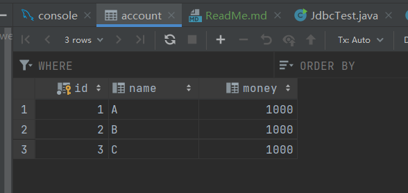

# 事务
## sql语句的事务
account表原始数据如下：


```mysql
# 开启事务
start transaction;

update account set money = 900 where name = 'A';
update account set money = 900 where name = 'B';
```
执行上述三条sql后，再刷新表数据如下：



可以看到数据并没有发生变化，原因时并没有提交这个事务。

当执行如下语句并并提交事务后，结果如下图：

```mysql
start transaction;

update account set money = 900 where name = 'A';
update account set money = 900 where name = 'B';

# 提交事务
commit 
```


可以看到数据发生了变化！
