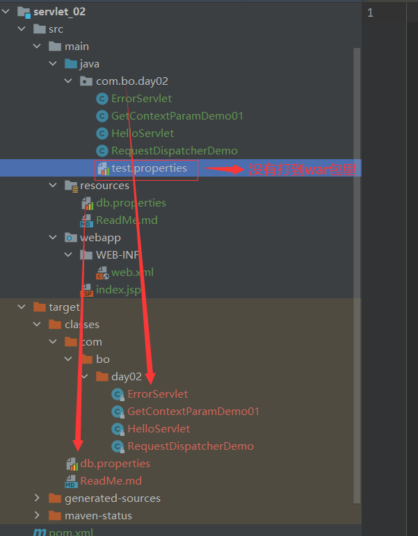
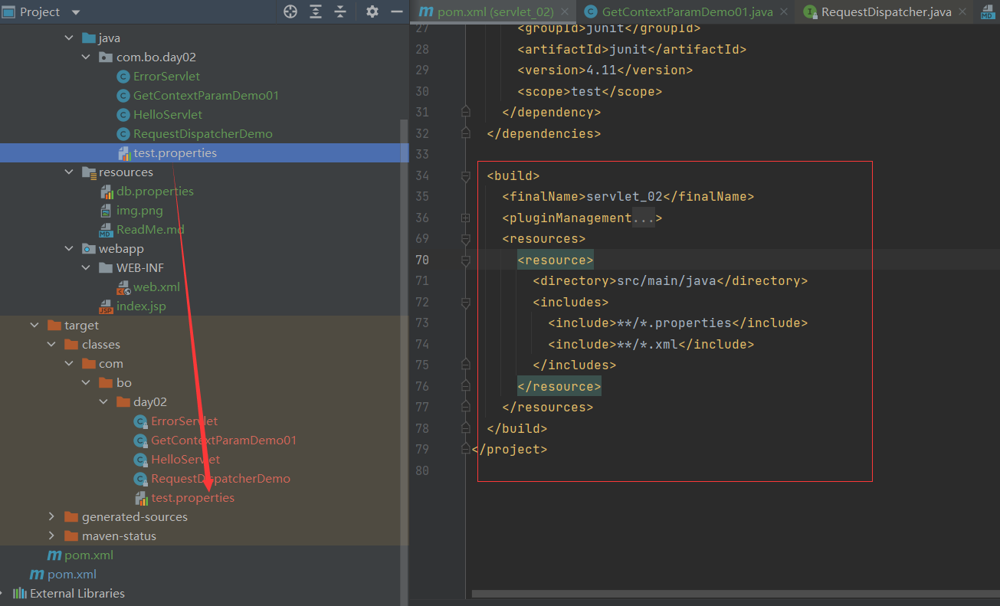
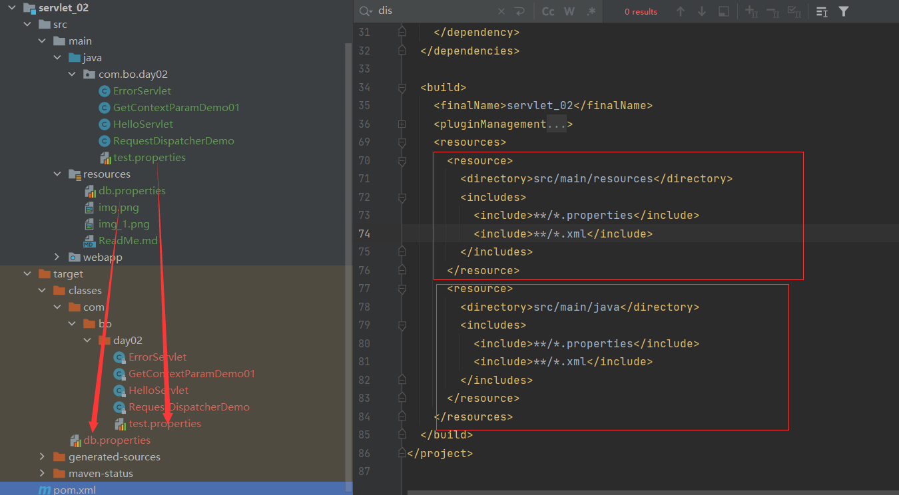
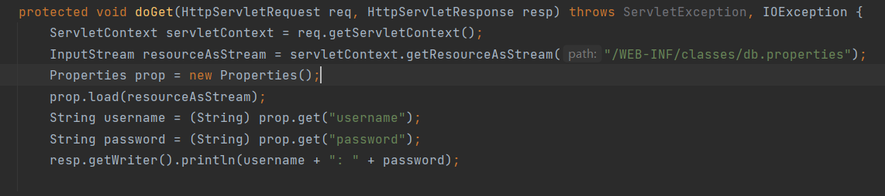

# servlet初识
## 利用ServletContext在两个servlet之间传递值
如servlet_02子模块
同时多个应用可以共存在一个tomcat工程中，如servlet_01和servlet_02

## 获取全局配置参数
web.xml配置
```xml
 <context-param>
    <param-name>url</param-name>
    <param-value>jdbc:mysql://localhost:3306/mybatis</param-value>
  </context-param>
```

```java
protected void doGet(HttpServletRequest req, HttpServletResponse resp) throws ServletException, IOException {
        ServletContext servletContext = req.getServletContext();
        String url = servletContext.getInitParameter("url");
        resp.getWriter().println(url);

    }
```

## RequestDispatcher转发到另一个servlet
```xml
<servlet>
    <servlet-name>dispatcher</servlet-name>
    <servlet-class>com.bo.day02.RequestDispatcherDemo</servlet-class>
  </servlet>
  <servlet-mapping>
    <servlet-name>dispatcher</servlet-name>
    <url-pattern>/s4</url-pattern>
  </servlet-mapping>
```

```java
System.out.println("enter RequestDispatcherDemo method!");
        ServletContext servletContext = req.getServletContext();
        req.setAttribute("className", "RequestDispatcherDemo");
        servletContext.getRequestDispatcher("/gp").forward(req, resp);
```

## classpath



如上，生成的class文件及resources文件里的所有内容都打包到了classes
路径下，也就是classpath！
但是，test.properties并没有被打倒war包里!要想将其打到war包里，必须在pom里
编写build指令。如下：



但是如上图，resources文件却不见了！！！

必须在build指定所有的文件才可以，如下：



## 利用properties读取配置文件
代码如下：

