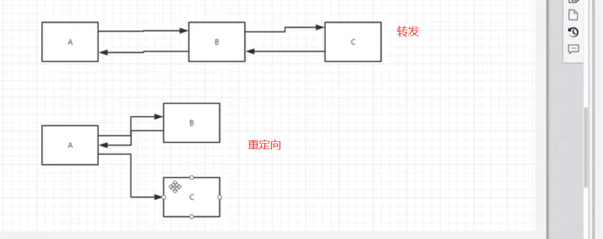
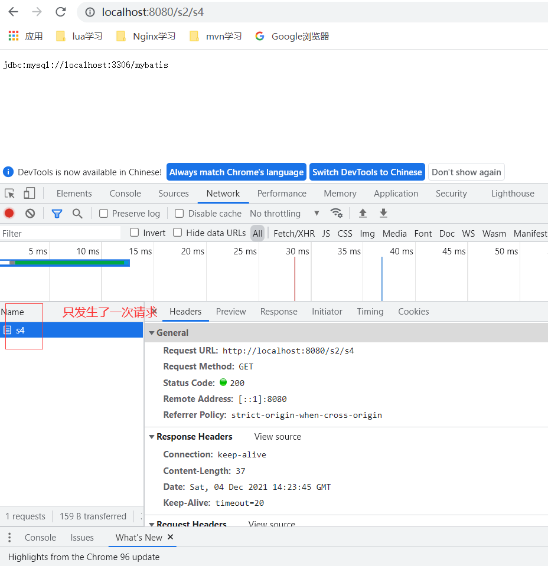
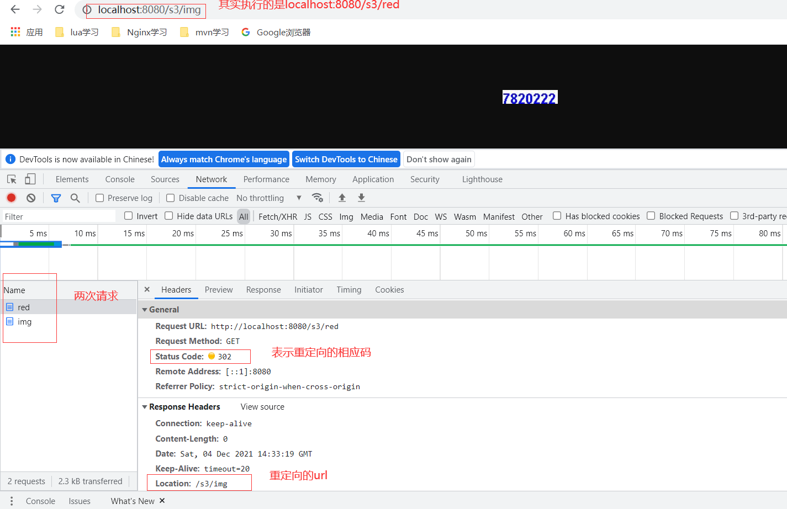
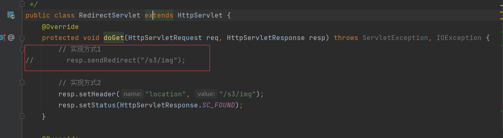
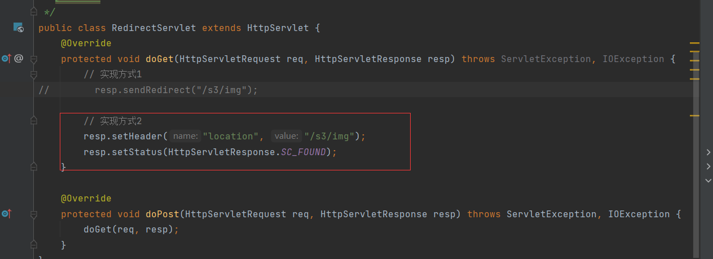
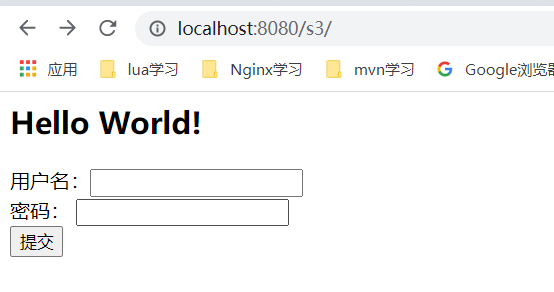
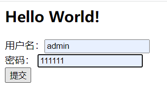
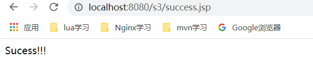
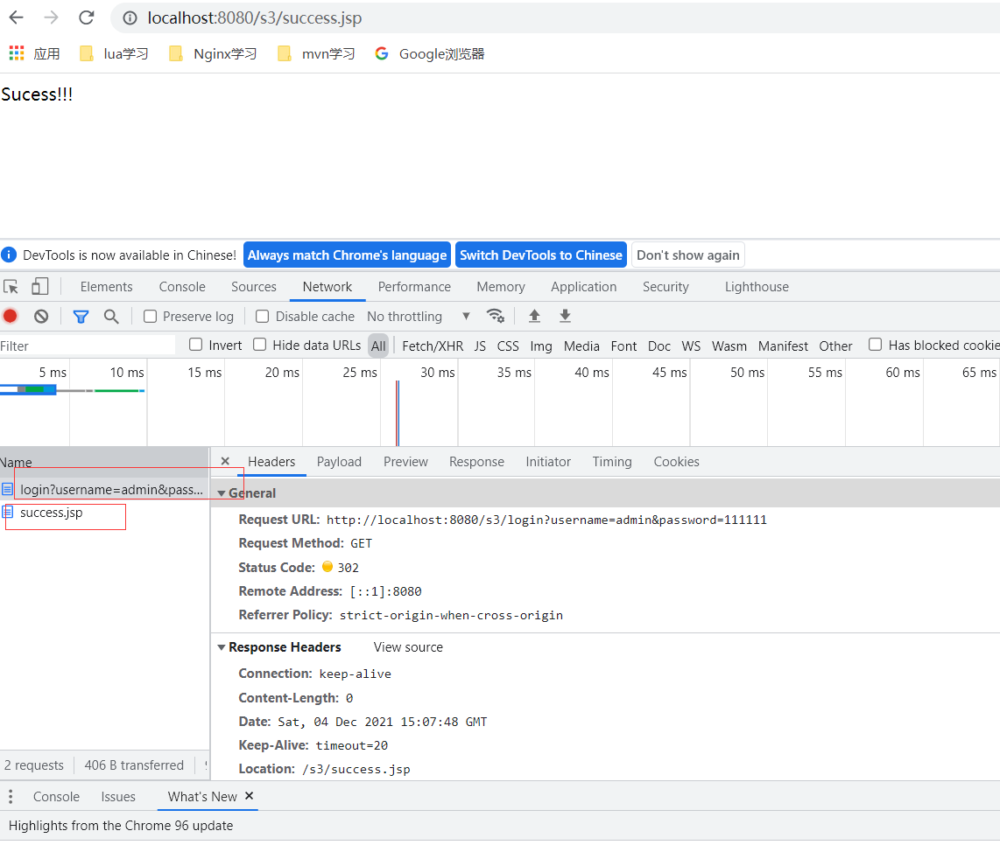

# 转发和重定向的区别



## 转发
见servlet_02子模块的com.bo.day02.RequestDispatcherDemo.doGet方法，是一个实现转发的方法，
客户端转包如下：



## 重定向
代码见servlet_03的com.bo.day02.RedirectServlet.doGet，效果如下：



可见重定向时，url发生了改变，且客户端请求了两次。

## 实现重定向的两种方式
### 方式1
```java
resp.sendRedirect("/s3/img");
```
    


### 方式2
```java
resp.setHeader("location", "/s3/img");
resp.setStatus(HttpServletResponse.SC_FOUND);
```



## 提交表单-->重定向-->显示成功
1、先执行http://localhost:8080/s3/
显示如下：



2、输入表单并点击提交





