# cookie和session
一个网站，怎么证明你来过？

客户端   服务端

1、服务端给客户端一个“信件”，客户端下次访问服务端带上“信件”就可以了。 cookie

2、服务器登记你来过了，下次你来的时候服务器来匹配你。 session

## 保存会话的两种技术
cookie：
* 客户端技术（响应、请求）

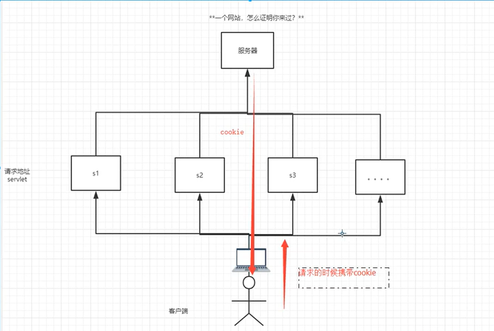

session：
* 服务器技术，利用这个技术，可以保存用户的会话信息。我们可以把信息或者数据放在session中。

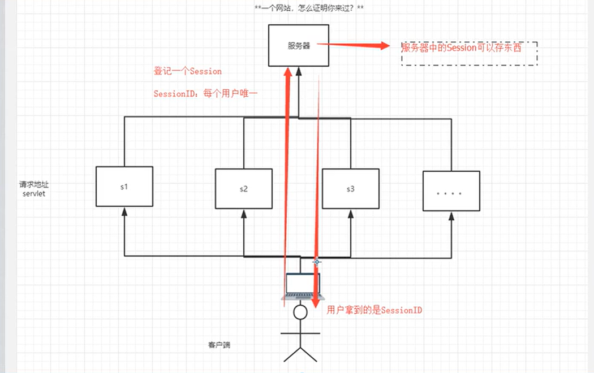

常见场景：网站登录之后，你下次不用再登录了，第二次访问直接就可以登录上去了。

## cookie
1、从请求中拿到cookie信息；

2、服务器响应给客户端cookie。

在CookieDemoServlet的例子中，当第一在浏览器执行http://localhost:8080/s5/cookie1时，
效果如下：

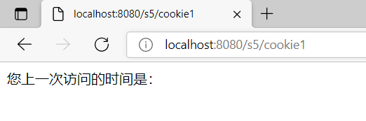

可见，第一次访问并没有“上一次登录时间”。
当再次执行http://localhost:8080/s5/cookie1时，效果如下：

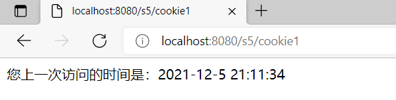

有了“您上一次访问的时间是”的记录

当关掉浏览器，再次打开浏览器并执行http://localhost:8080/s5/cookie1时，效果如下：

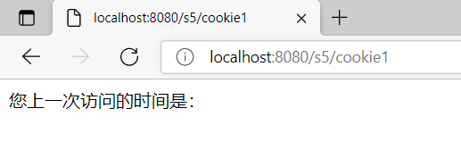

仍是没有“上一次登录时间”。

完整代码如下：

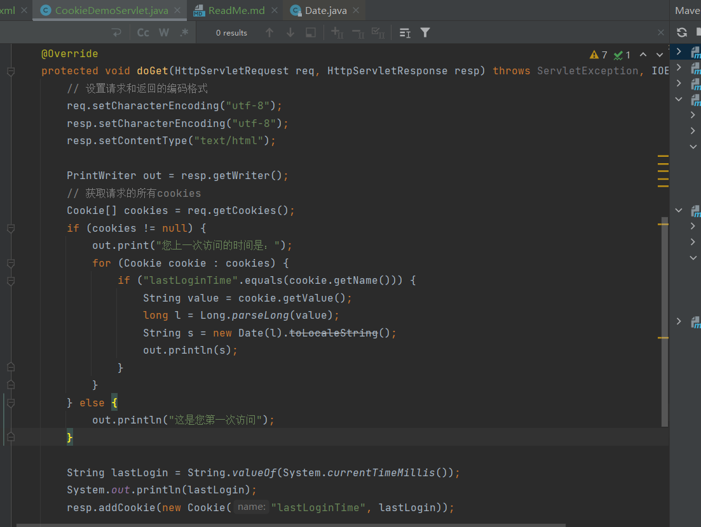

当在代码中设置了cookie的最大失效时间时，在访问过http://localhost:8080/s5/cookie1后，即使关掉浏览器再次打开浏览器
并执行http://localhost:8080/s5/cookie1，效果如下：

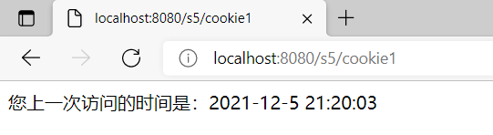

代码如下：

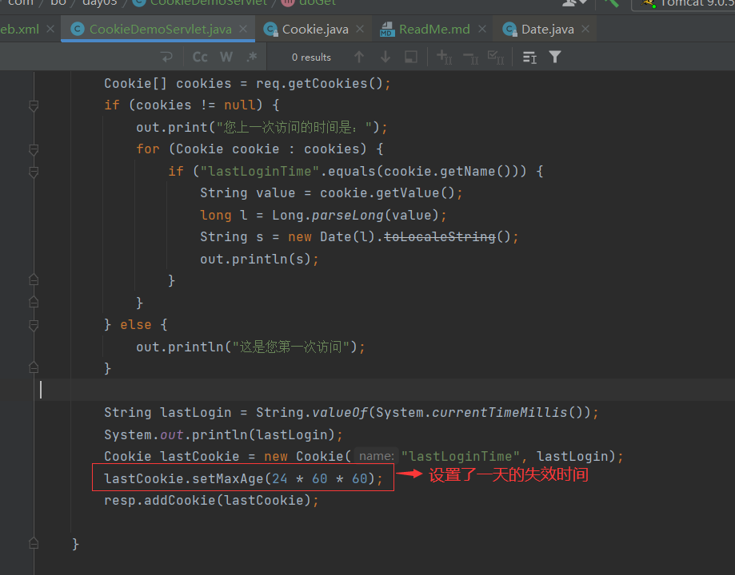

这说明，即使浏览器关闭了，针对cookie设置的一天失效时间仍会生效！！！关掉浏览器并再次打开浏览器，
然后访问http://localhost:8080/s5/cookie1，仍会传递未失效的lastLoginTime！

cookie：在本机电脑上也会存在大量的cookie文件，一般会存在本地用户下的appData文件夹里。

## cookie是否会有限制？
* 一个cookie只能保存一个信息
* cookie大小有限制，不能超过4kb

## 删除cookie
* 不设置有效期，关闭浏览器，自动失效；
* 设置有效时间为0。可以让该cookie立刻失效！

## session(重点)
什么是session：
* 服务器会给每一个用户（浏览器）创建一个session对象；
* 一个session独占一个浏览器，只要浏览器没有关闭，这个session就存在；
* 用户登录之后，整个网站他都可以访问！-->保存用户的信息；保存购物车的信息...

### session举例
服务器会给每一个用户（浏览器）创建一个session对象！

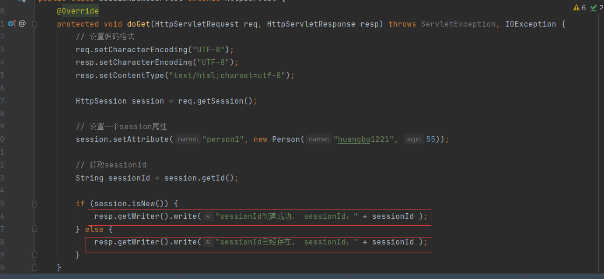

当在浏览器第一次执行http://localhost:8080/s5/se1时，显示效果如下：
Chrome浏览器：

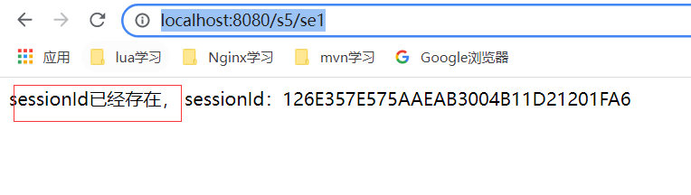

IE浏览器：

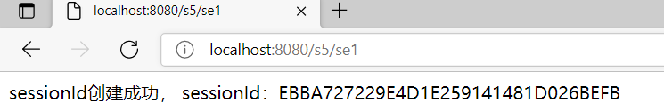

sessionId已经存在！！！**两个浏览器的sessionId不一样！！！**

表明当浏览器与服务器建立连接时，就已经创建了session，此时访问http://localhost:8080/s5/se时，session
不是New状态！

查看浏览器抓包情况如下：

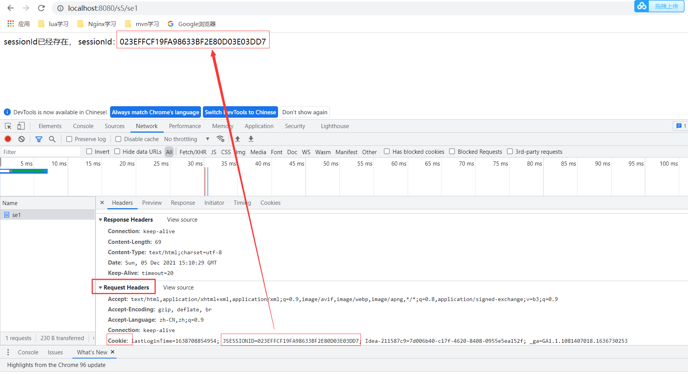

执行http://localhost:8080/s5/se时，浏览器请求的cookie里携带了唯一标志sessionId，用以向服务器进行认证！
但是在上面的代码里，session里明明还写了一个属性：
```java
session.setAttribute("person1", new Person("huangbo1221", 55));
```
为什么在请求的cookie中没看到？
说明服务器在第一次创建session的时候，只返回了浏览器起唯一标志作用的sessionId，而session的其他信息则存在了服务器。

### 新建servlet取出session里的信息
代码如下：

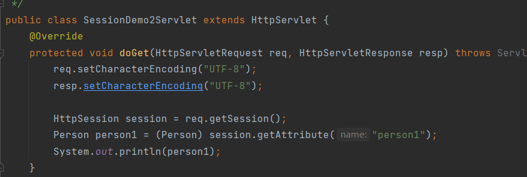

首先执行http://localhost:8080/s5/se1，添加属性。然后执行http://localhost:8080/s5/se2，效果如下：

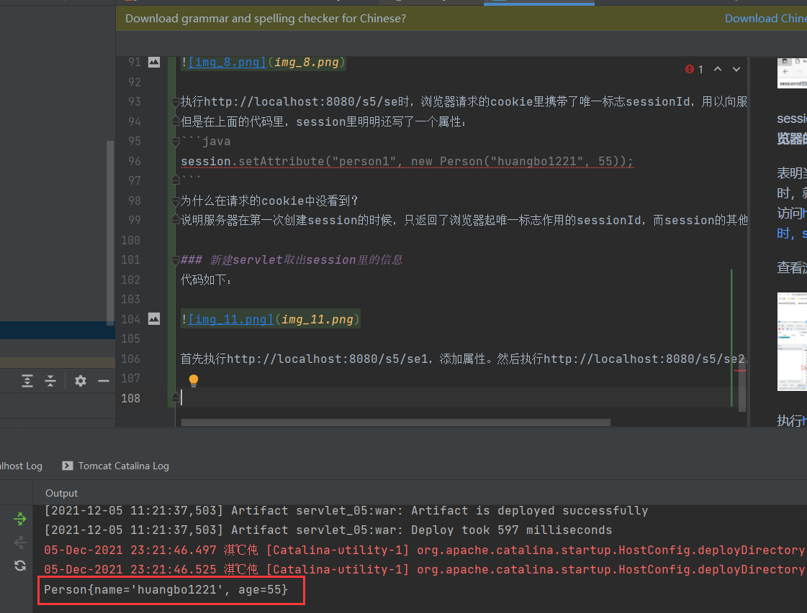

输出了对象

### 主动注销会话session，方式1
代码如下：

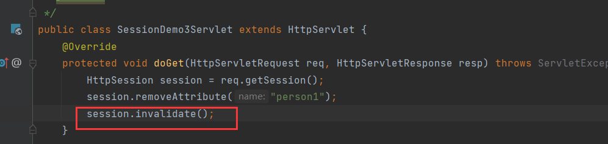

首先执行http://localhost:8080/s5/se1，效果如下：

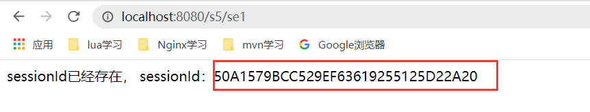

再执行http://localhost:8080/s5/se3，效果如下：

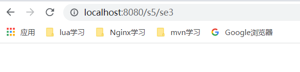

最后再执行http://localhost:8080/s5/se1，效果如下：

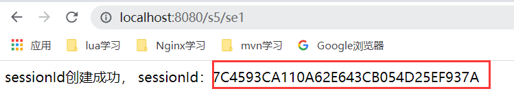

可以两次的sessionId并不一样！！但是浏览器并没有关闭！！说明注销时清除了会话！

### 主动注销会话session，方式2
在web.xml里进行配置如下：
```xml
  <session-config>
    <!--  表示session在1分钟后自动注销  -->
    <session-timeout>1</session-timeout>
  </session-config>
```

## session和cookie的区别
* cookie是把用户的数据写给用户的浏览器，浏览器保存（可以保存多个）
* session把用户的数据写到用户独占的session中，服务器端保存（保存重要的信息，减少服务器资源的额浪费）
* session对象由服务器创建；

使用场景：
* 保存一个登录用户的信息；
* 购物车信息；
* 在整个网站中经常会使用的数据，我们将它保存在session中