# JSP
## 什么是JSP
java server pages：java服务器端页面，也和servlet一样，用于动态web技术。
最大的特点：
* 写jsp就像在写html
* 区别：
  1、HTML只给用户提交静态的数据
  2、jsp页面可以嵌入java代码，为用户提供动态数据。

## JSP原理
### 思路：jsp到底是怎么执行的？
1、代码层面如下：

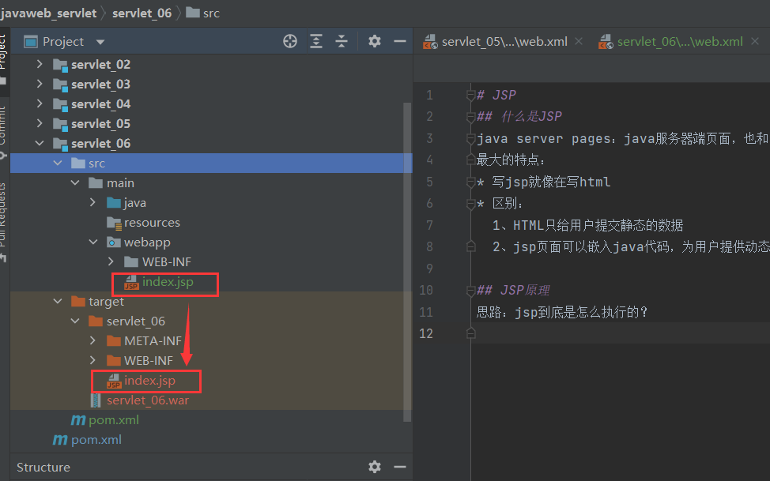

写的index.jsp在target也生成了。

2、服务器内部怎么工作？
比如tomcat在控制台启动的时候，也可以执行jsp文件，可以看下tomcat下的work目录，如下：

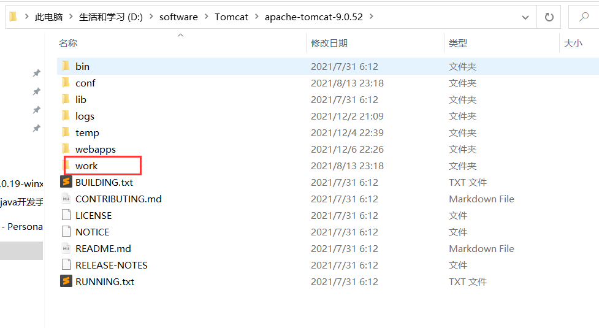

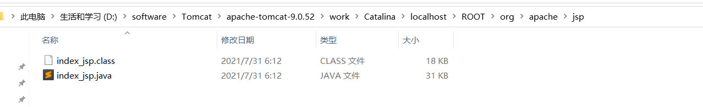

上面文件里有index_jsp.java和index_jsp.class。难道index.jsp实际是被转换成了java文件，然后再
到虚拟机执行的？继续往下分析。

使用idea配置tomcat启动时，会在idea的tomcat中生成一个work目录。路径如下：
C:\Users\15603\AppData\Local\JetBrains\IntelliJIdea2021.2\tomcat\a3d6fc4b-f054-4fc6-979d-502920e4c09d\work

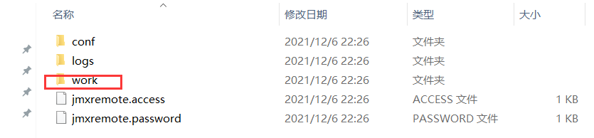

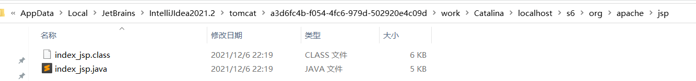

上面文件夹里也有index_jsp.java和index_jsp.class。说明index.jsp确实被转成了java程序。

### 浏览器向服务器发送请求，不管访问什么资源，其实都是在访问servlet。
jsp最终也会被转化为一个java类。

为什么说都是在访问servlet？
看看被转化生成的index_jsp.java:

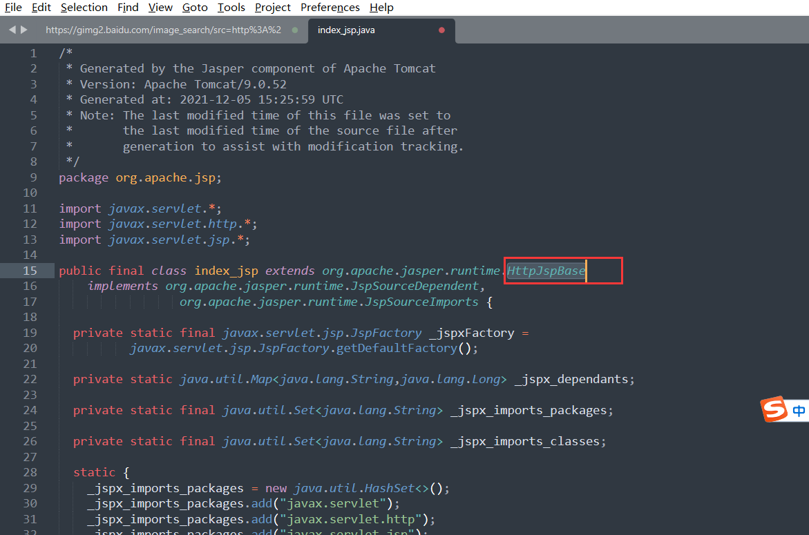

index_jsp类继承了HttpJspBase，那么HttpJspBase是什么呢？如下：

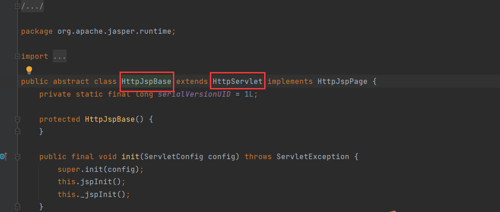

HttpJspBase又继承了HttpServlet，所以index_jsp相当于一个servlet。

### 再来看看index.jsp源文件和转化生成的index_jsp.java
jsp源文件：

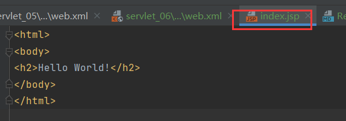

转化生成的java代码：

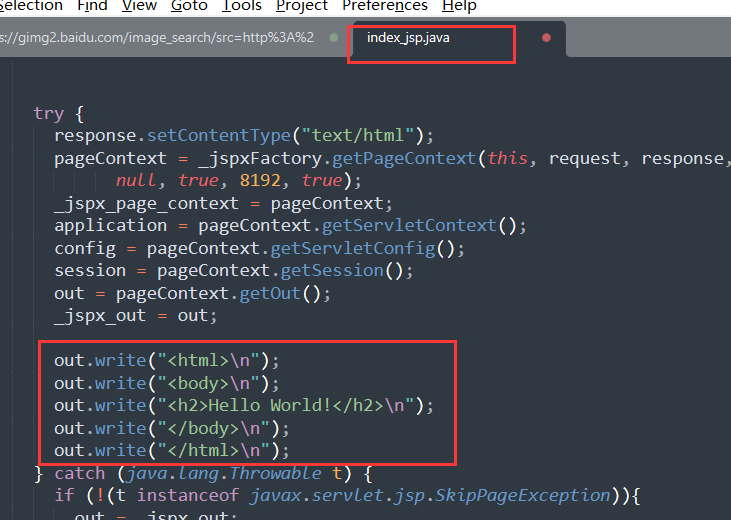

可以看到，把jsp代码嵌入到了java代码里，然后再执行！

jsp本质就是一个servlet。
```java
// 初始化
public void _jspInit() {
  }
// 销毁
  public void _jspDestroy() {
  }
// JSPService
  public void _jspService(HttpServletRequest request, HttpServletResponse response)
```

1、判断请求
```java
if (!javax.servlet.DispatcherType.ERROR.equals(request.getDispatcherType())) {
      final java.lang.String _jspx_method = request.getMethod();
      if ("OPTIONS".equals(_jspx_method)) {
        response.setHeader("Allow","GET, HEAD, POST, OPTIONS");
        return;
      }
      if (!"GET".equals(_jspx_method) && !"POST".equals(_jspx_method) && !"HEAD".equals(_jspx_method)) {
        response.setHeader("Allow","GET, HEAD, POST, OPTIONS");
        response.sendError(HttpServletResponse.SC_METHOD_NOT_ALLOWED, "JSP 只允许 GET、POST 或 HEAD。Jasper 还允许 OPTIONS");
        return;
      }
    }
```

2、内置一些对象
```java
final javax.servlet.jsp.PageContext pageContext; // 页面上下文
javax.servlet.http.HttpSession session = null; // session
final javax.servlet.ServletContext application; // applicationContext
final javax.servlet.ServletConfig config; // config
javax.servlet.jsp.JspWriter out = null; // out
final java.lang.Object page = this; // page：当前页
javax.servlet.jsp.JspWriter _jspx_out = null;
javax.servlet.jsp.PageContext _jspx_page_context = null;
```

3、输出页面前增加的一些代码
```java
try {
      response.setContentType("text/html"); // 设置相应的文本类型
      pageContext = _jspxFactory.getPageContext(this, request, response,
      			null, true, 8192, true);
      _jspx_page_context = pageContext;
      application = pageContext.getServletContext();
      config = pageContext.getServletConfig();
      session = pageContext.getSession();
      out = pageContext.getOut();
      _jspx_out = out;

      out.write("<html>\n");
      out.write("<body>\n");
      out.write("<h2>Hello World!</h2>\n");
      out.write("</body>\n");
      out.write("</html>\n");
    } catch (java.lang.Throwable t) {
```
4、以上的这些对象，可以直接在jsp文件中使用
用<% %>括起来才可以写java代码！！！
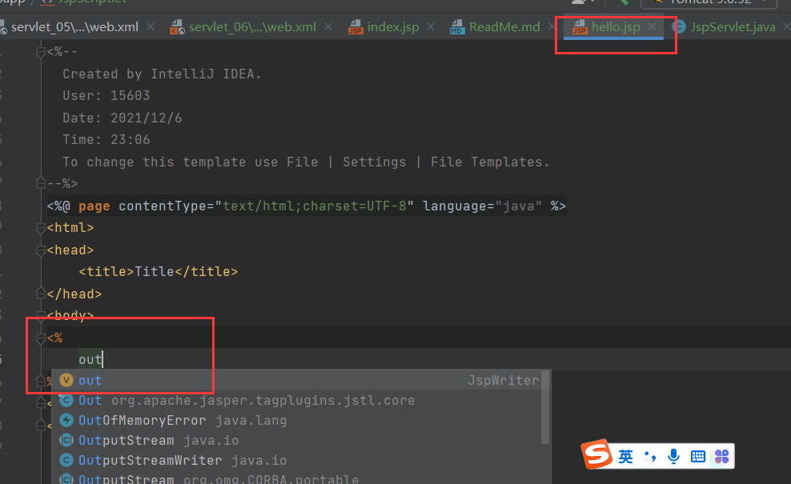

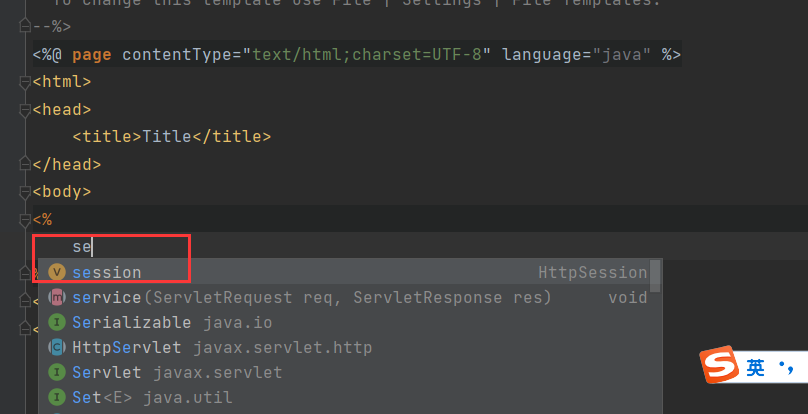

可以直接使用out\session等

### 不直接使用jsp，是不会转化成java文件的
如下没有执行http://localhost:8080/s6/hello.jsp时

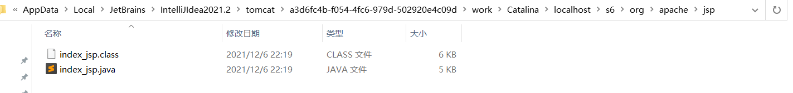

执行http://localhost:8080/s6/hello.jsp后

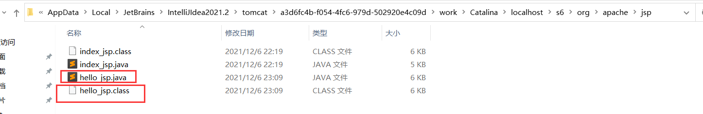

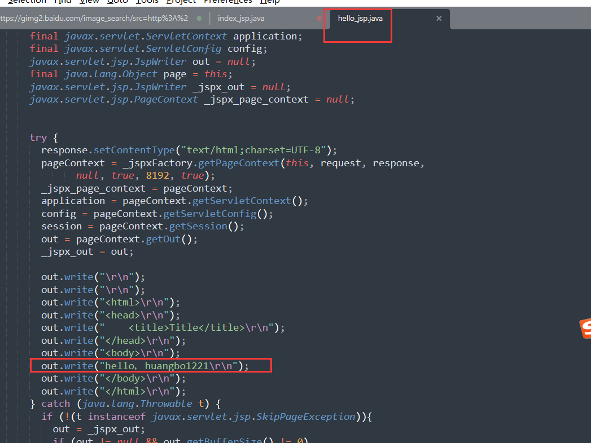

### jsp访问时的整体流程

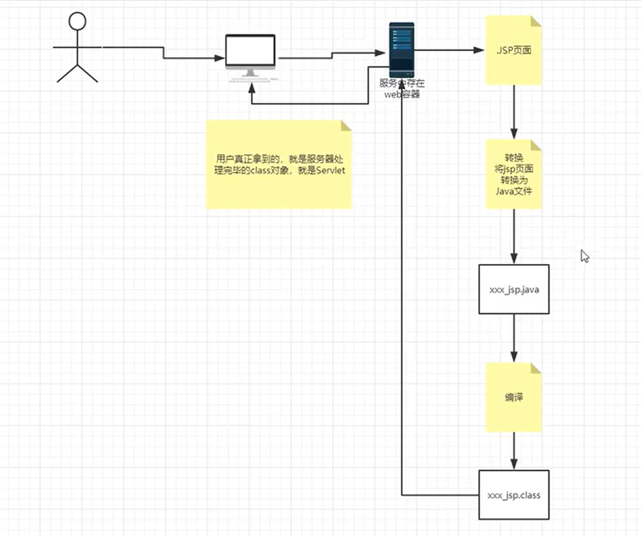

### 实例

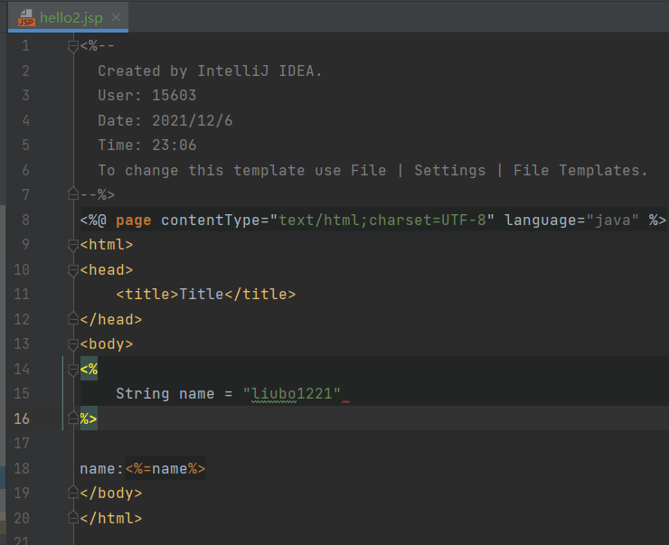

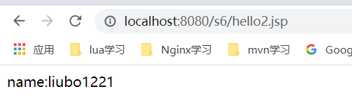

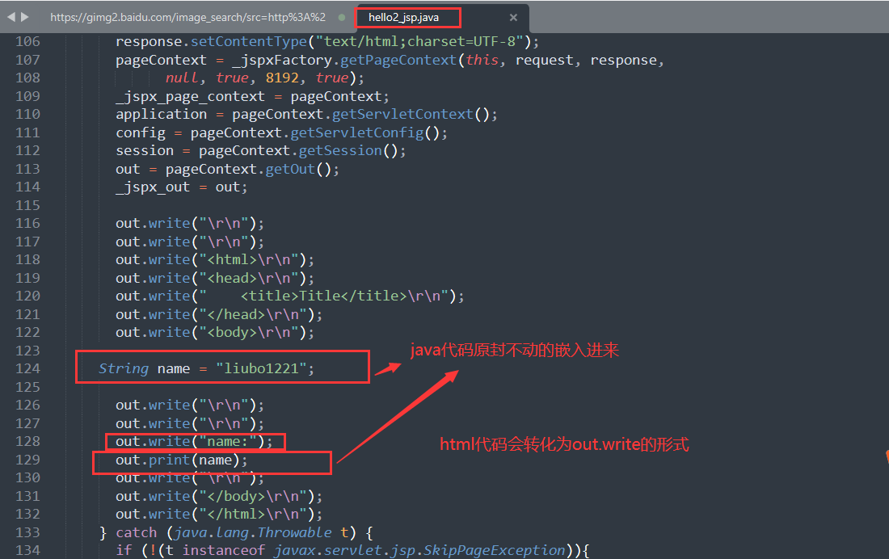


如下图：不加“=”会报错！

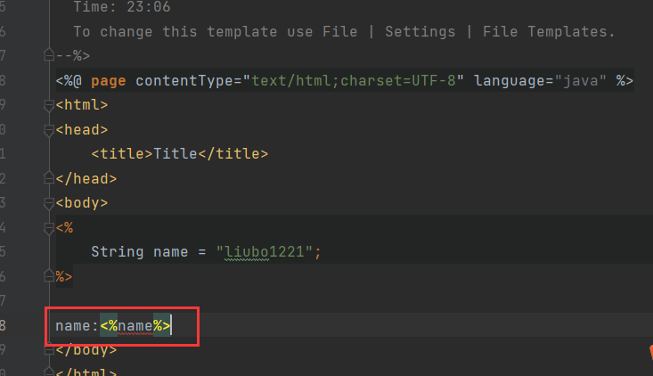
