# JSP学习
## jsp简单语法
代码如下：

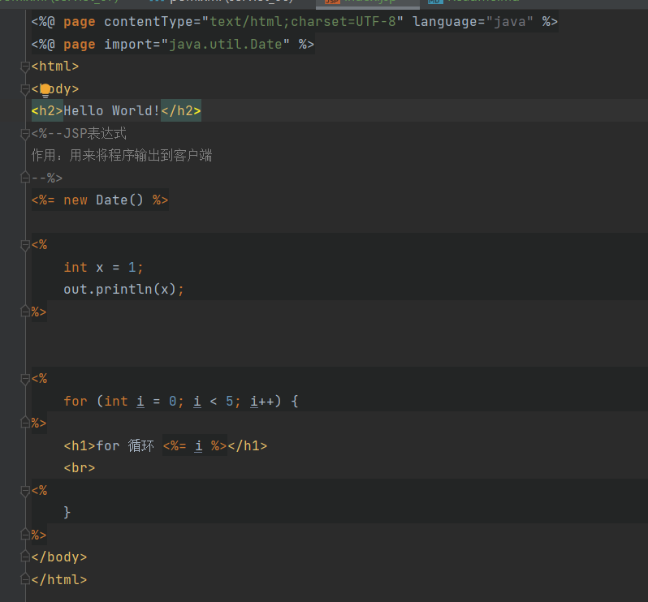

执行后的输出如下：

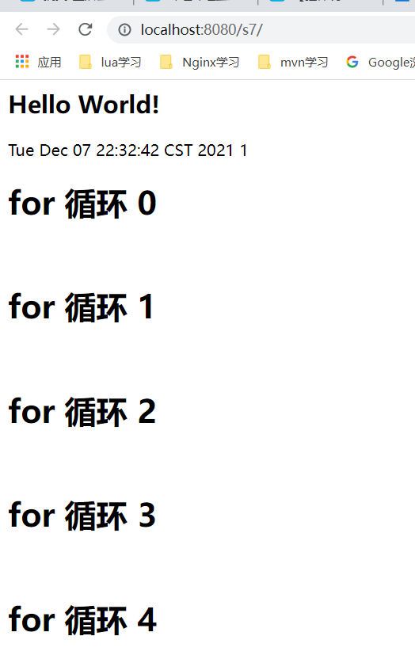

转化成的java代码如下：

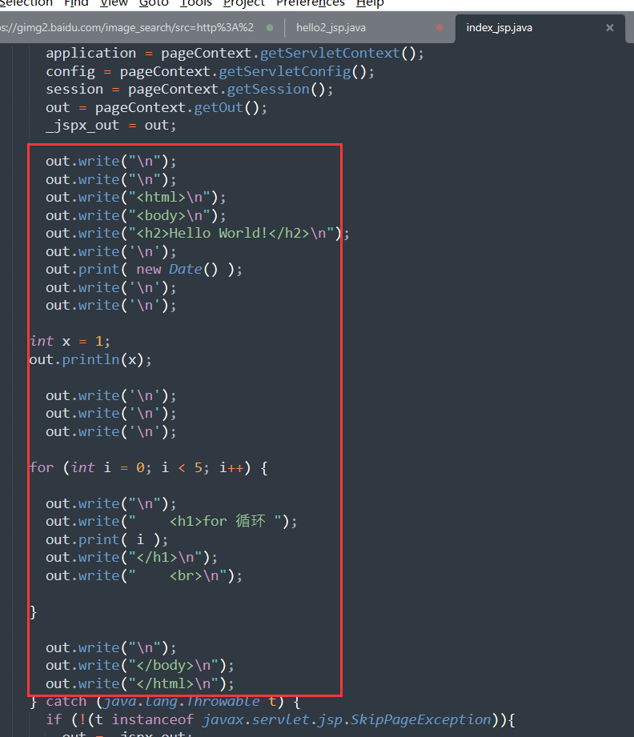

注意：上述的java代码全部在_jspService方法里！！！
也就是说在<% %>或<%= %>里写的java代码，全部嵌入到了转化后的java代码中的jspService方法里！
那么有没有可以嵌入到全局的代码（非jspService）里的呢？

## jsp声明
代码如下：

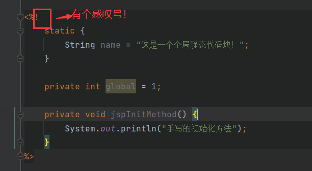

jsp转化的java代码如下：

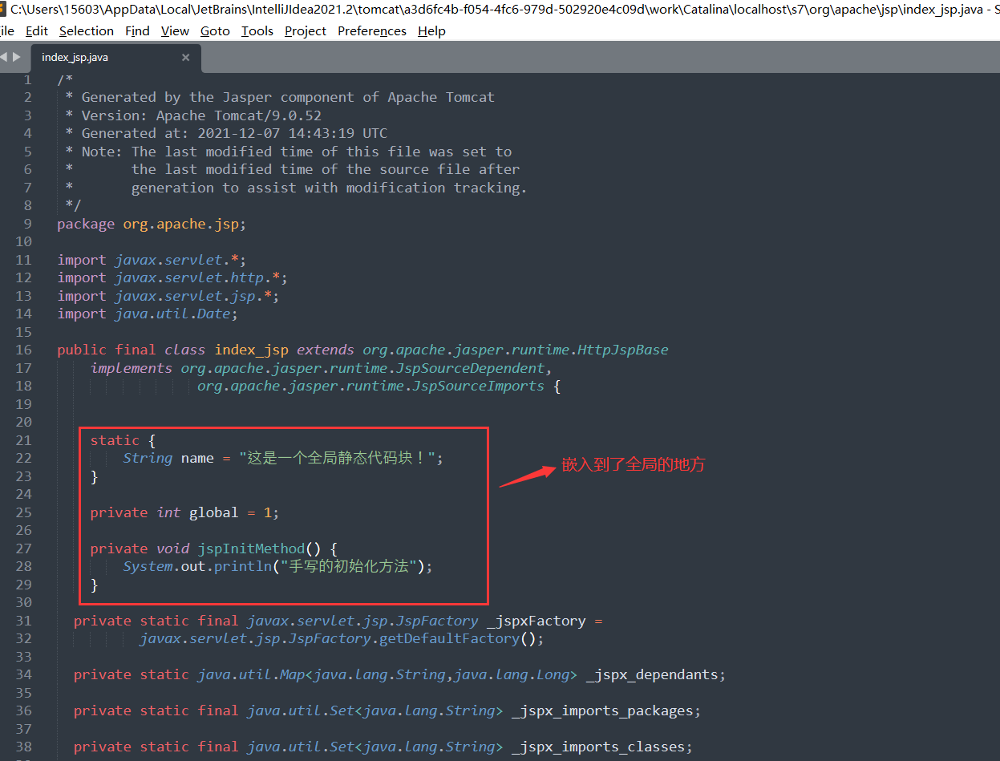

可见：要想使jsp里的java代码在转化后，嵌入到全局代码中，jsp语法为：
```java
<%!

%>
```

## 怎么定制404界面个500界面
### 配置web.xml
web.xml配置如下：

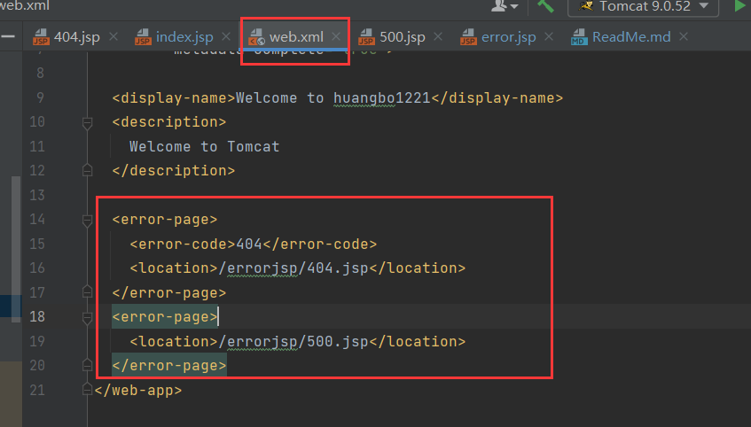

404.jsp如下：

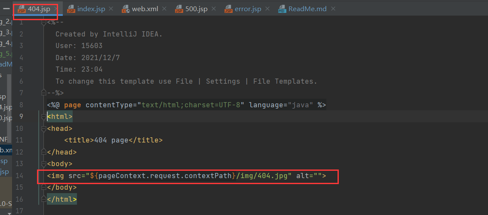

500.jsp界面如下：

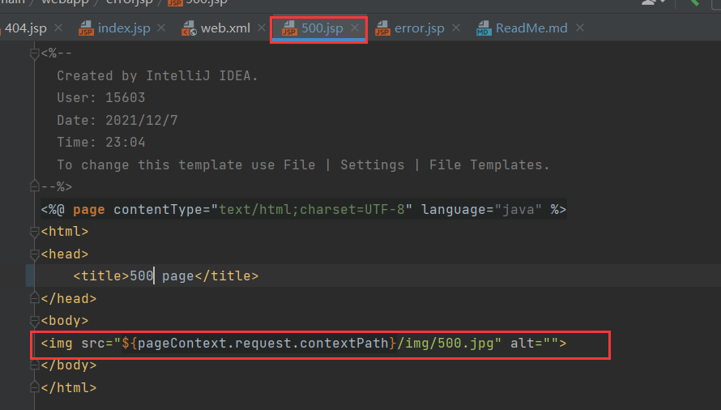

结果分别如下：

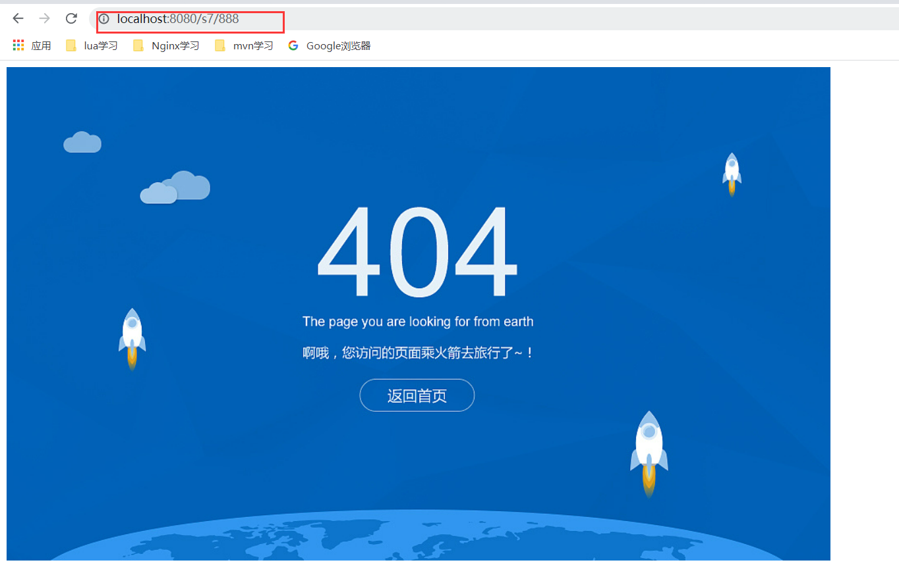

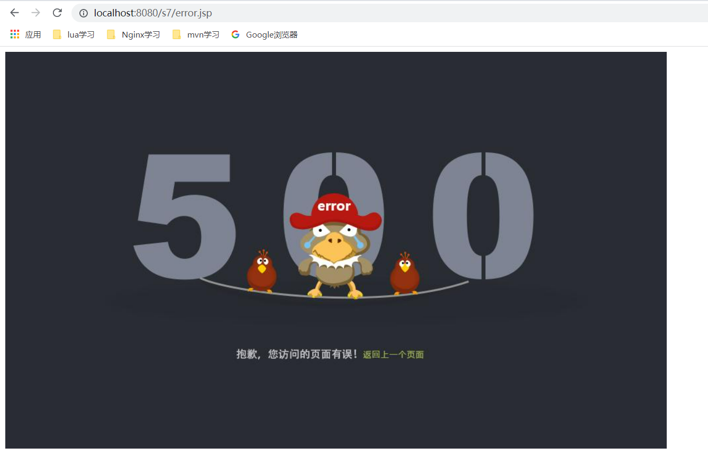

### jsp直接配置错误界面
首先把web.xml的配置项删掉，如下：

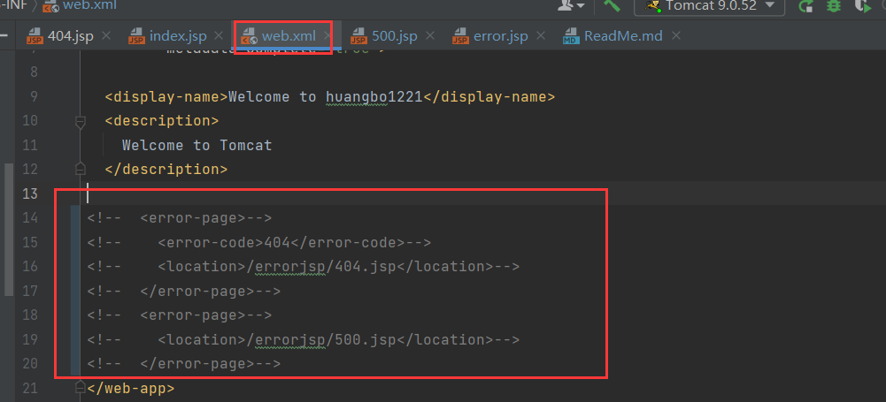

jsp配置如下：

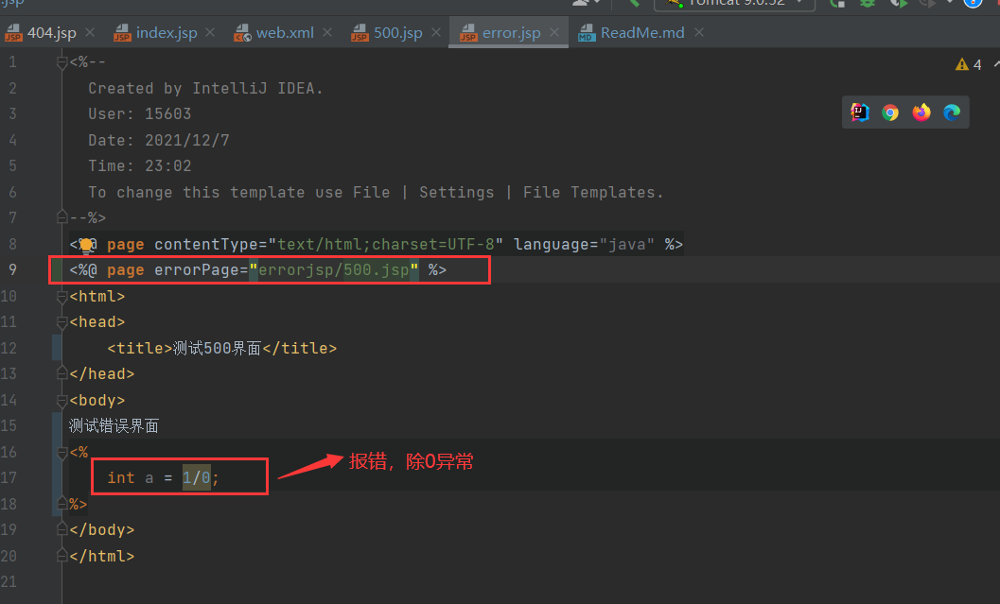

效果如下：

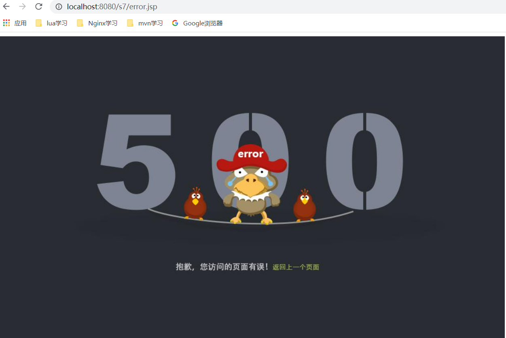

## jsp部分标签
### <%@ include%>和<jsp:include
代码如下：

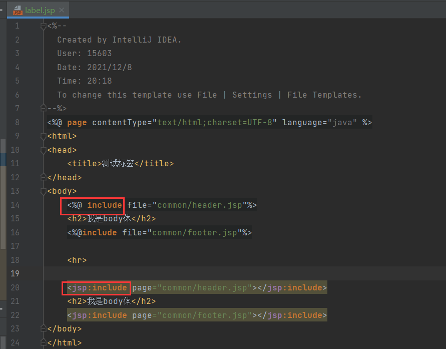

效果如下：

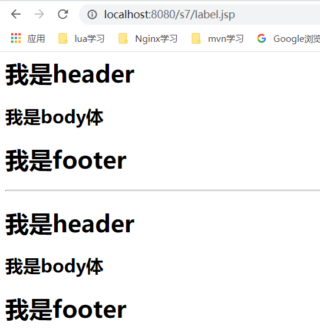

## 九大内置对象
* PageContext 存东西
* Request 存东西
* Response
* Session 存东西
* Application [ServletContext] 存东西
* Config [ServletConfig]
* out
* page
* Exception

### 内置对象的存储
代码如下：

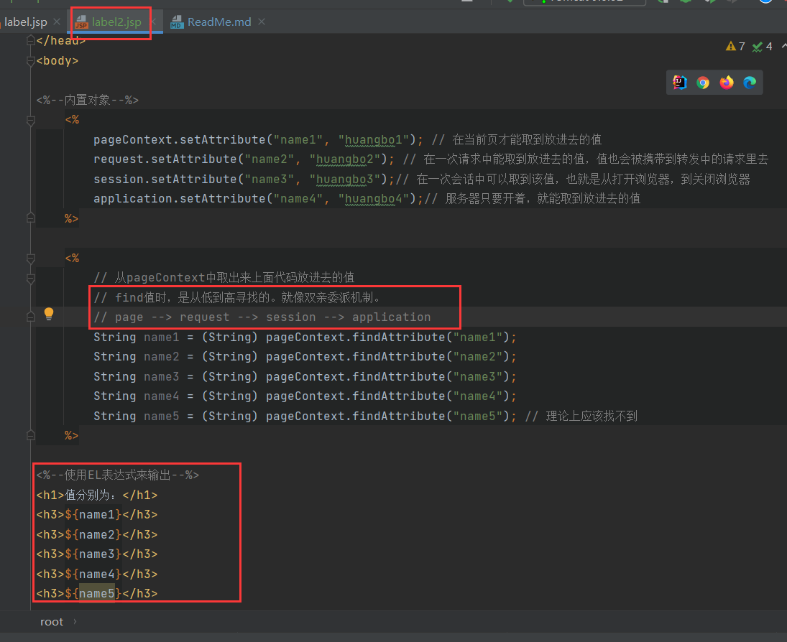

结果如下：

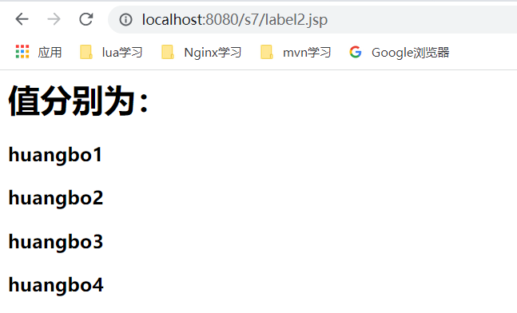

那同一个会话的其他请求可以取到哪些值？
代码如下：

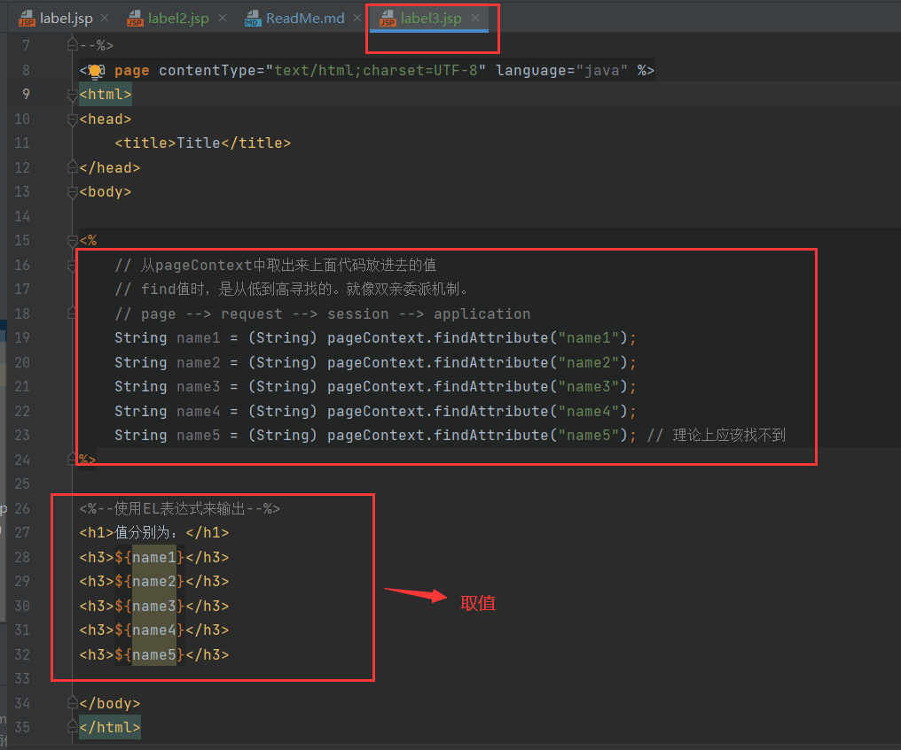

结果如下：

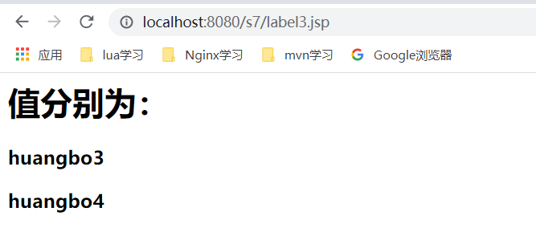

只能取到session和application存储的值！！！

当然作用域也可以手动指定，比如在pageContext赋的值，让其在其他会话的请求也可以取到，
赋值时执行的方法为：
```java
// 也可通过执行后org.apache.jasper.runtime.PageContextImpl.setAttribute(java.lang.String, java.lang.Object, int)
// 方法来指定其作用域
```