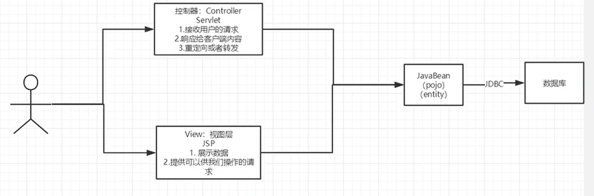
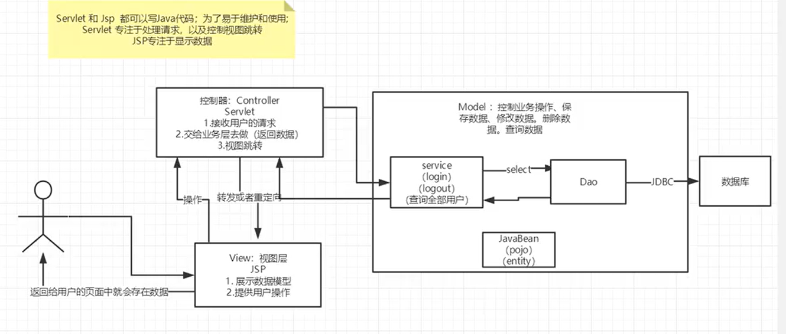

# MVC三层架构
## 什么是MVC？
model、view、controller 模型、视图、控制器

## 两层架构

servlet-->crud-->数据库
弊端：程序十分臃肿、不利于维护！

## MVC三层架构示意图

model
* 业务处理：业务逻辑（service）
* 数据持久层：CRUD（Dao）

View
* 展示数据
* 提供链接发起servlet请求（a标签、form表单标签、img...）

Controller（servlet）
* 接收用户的请求：（req：请求参数、session信息）
* 交给业务层处理对应的代码
* 控制视图的跳转
    
