# Filter
## filter优先于servlet执行

编写一个Filter实例，如下：

web.xml配置如下：

演示如下：

请求为http://localhost:8080/s9/show，出现了乱码，因为没经过过滤器

请求为http://localhost:8080/s9/servlet/show，没出现乱码，因为经过了过滤器

## 服务器启动时，Filter开始初始化

## 服务器停止时，Filter开始销毁

# Listener监听器

## 实例演示（统计在线人数）
代码如下：

利用会话上下文统计在线人数，实现HttpSessionListener接口即可

web.xml配置如下：

当启动服务时，显示效果如下：

会显示有两个会话，原因时服务器启动时创建了多个会话（其中存在失败的会话被统计在内）

## 浏览器演示如下：

在新的浏览器启动时，显示效果如下：

可见增加了一个会话！

# 模拟用户登录
一般情况下，某些重要的内容只有用户登录后才可以访问，在登录之前，是不可见的！
在此设计一种案例来描述下此场景。

## 登录界面
执行http://localhost:8080/s9/login.jsp效果图如下：

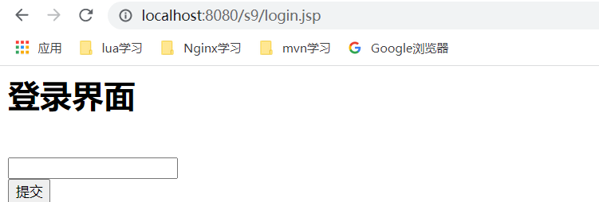

代码如下：

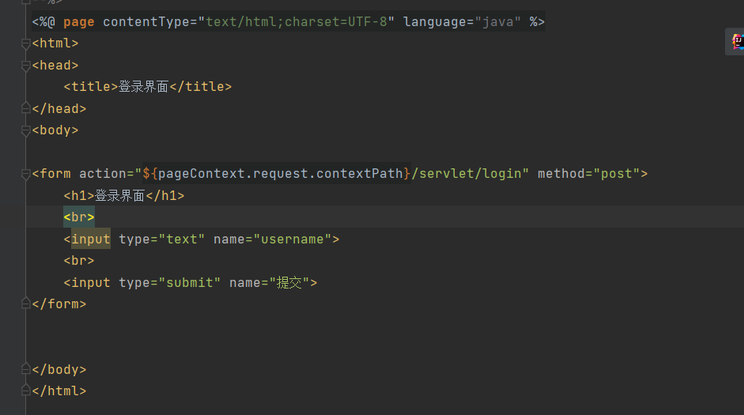

## 输入错误用户名

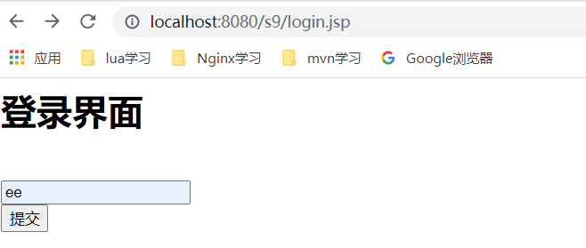

点击提交后，效果如下：

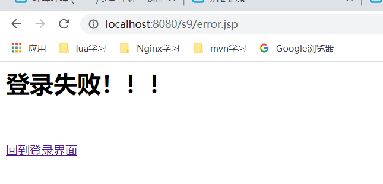

涉及的代码如下：

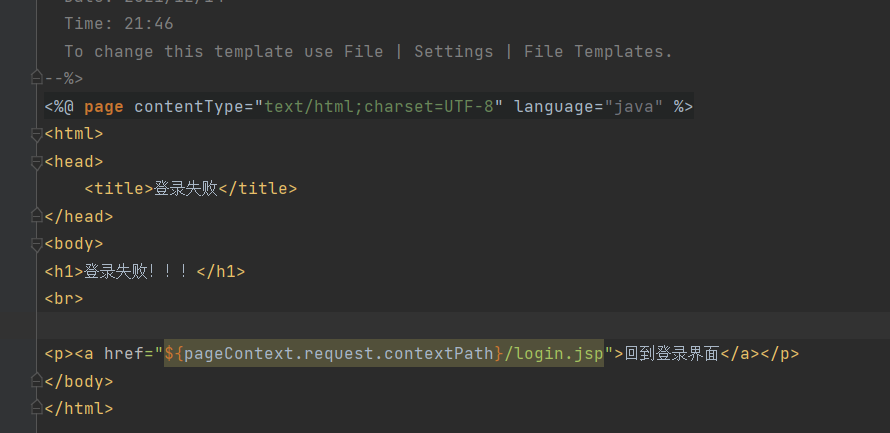

点击“回到登录界面”，效果如下：

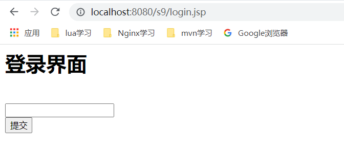

涉及到的代码如下：

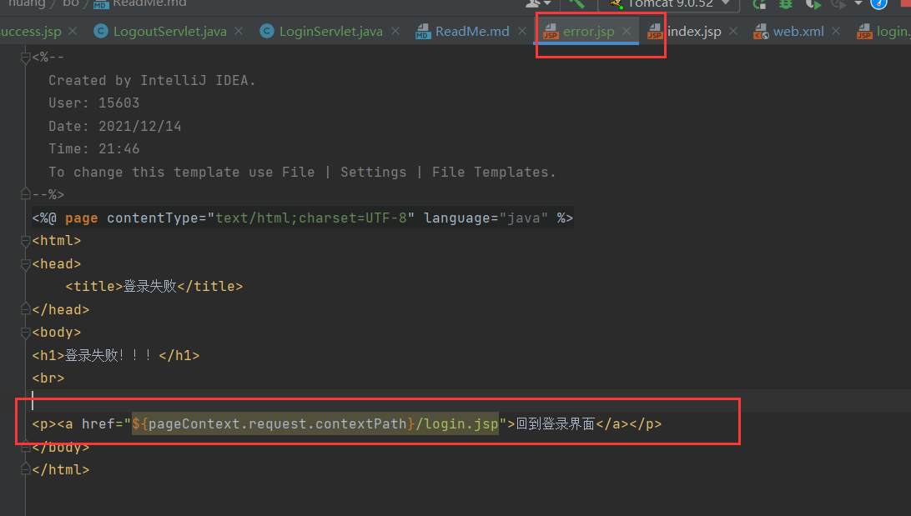
利用a标签实现

## 输入正确用户名

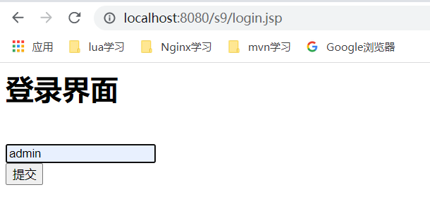

点击“提交”，效果如下：

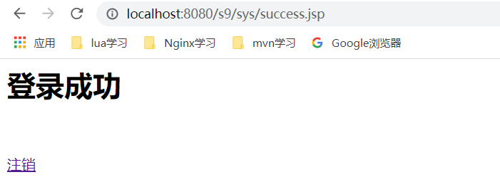

涉及到的代码如下：

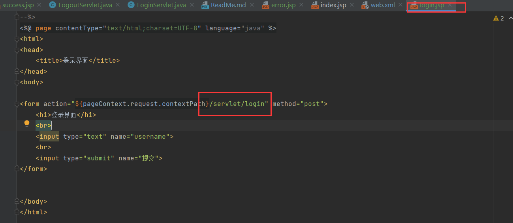

直接跳转“servlet/login”，web.xml配置如下：

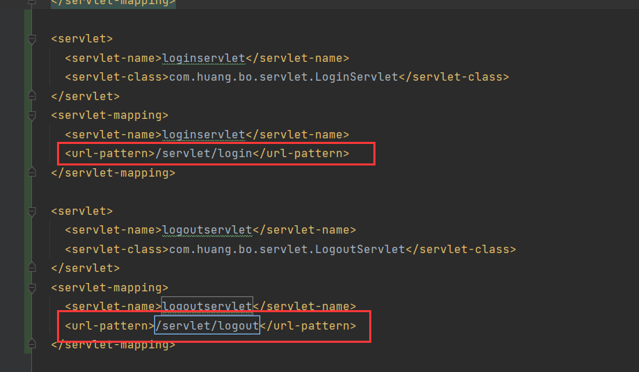

点击“注销”，效果如下：

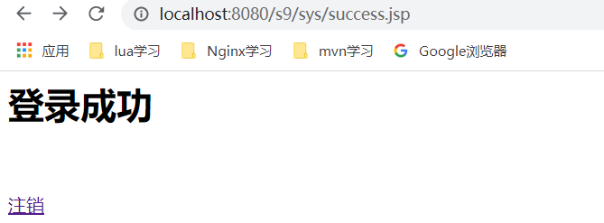

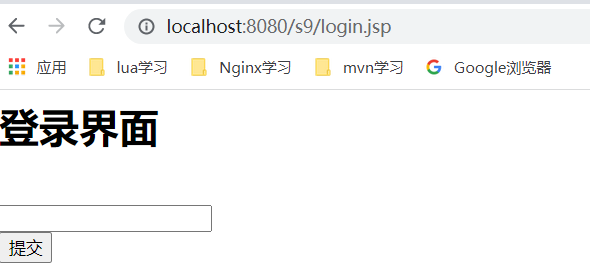

涉及到的代码如下：

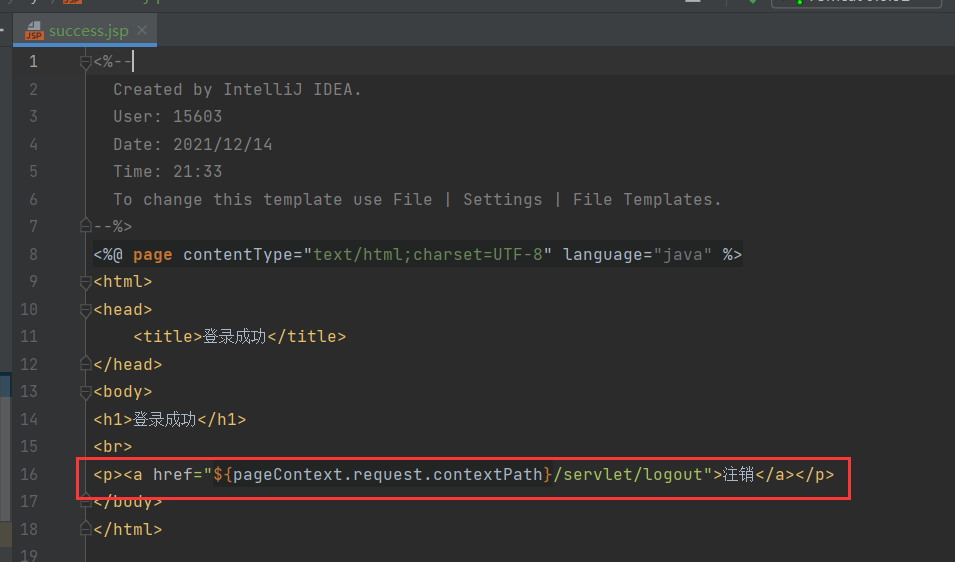

跳转到“/servlet/logout”,web.xml的配置见上面图示。涉及到的logoutservlet如下：

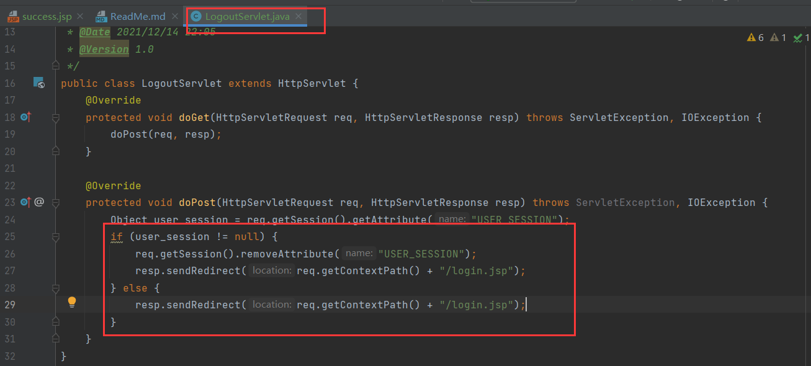

## 弊端！
登录成功后的success.jsp，即使未登录也可以直接访问到，如下：

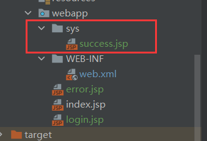

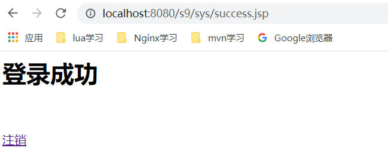

按合理的设计，只有登录后才可以访问！！！

## 设计filter过滤器，登录成功后才可以访问success.jsp

代码如下：

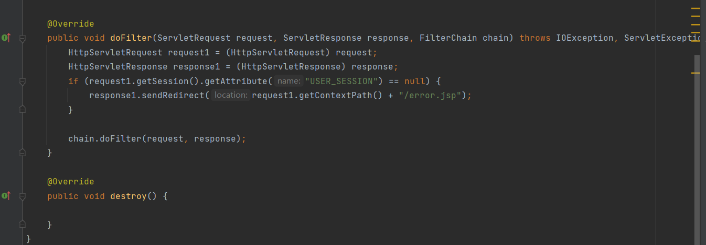

当USER_SESSION字段为空的时候，表明用户未登录，直接跳转到error.jsp界面！

web.xml配置如下：

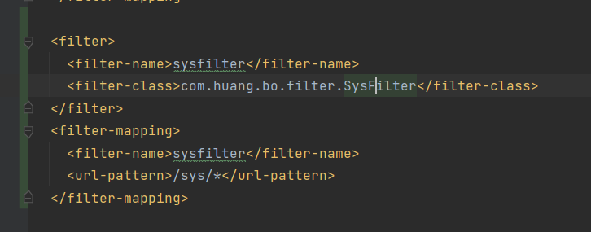

监听所有/sys/的请求，这表示所有获取系统内容的请求。

用户登录成功后的界面：

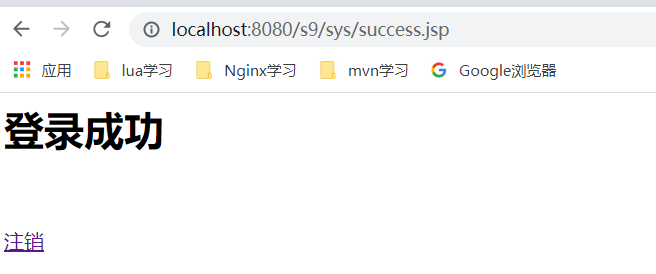

点击“注销”后，USER_SESSION会置为空，界面如下：

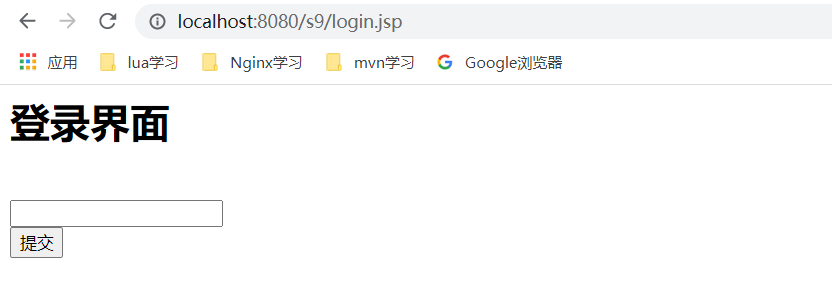

此时执行http://localhost:8080/s9/sys/success.jsp，效果如下：

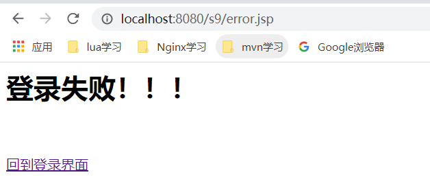

未登录的用户受到了拦截！！！
