# Filter
## filter优先于servlet执行

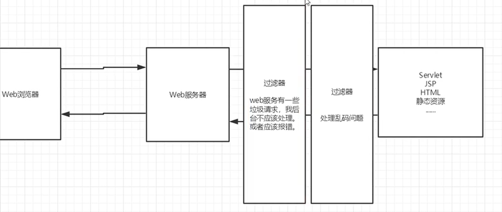

编写一个Filter实例，如下：

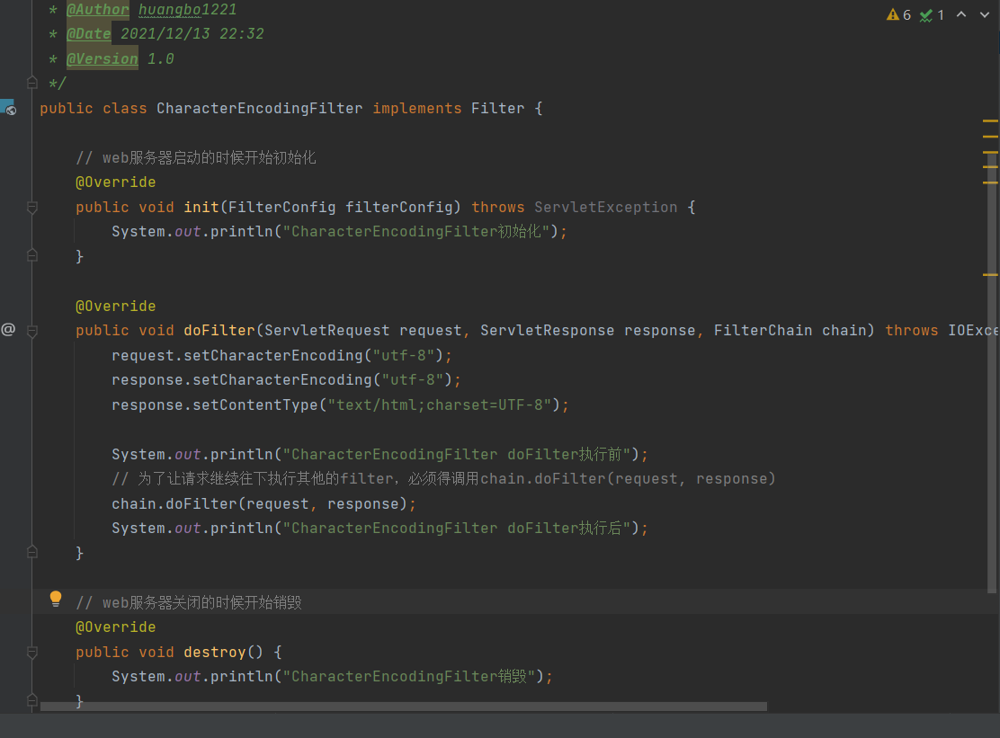

web.xml配置如下：

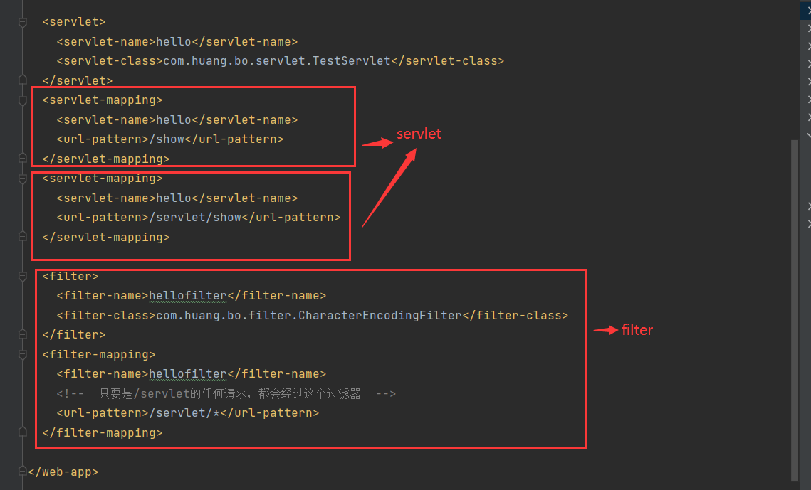

演示如下：

请求为http://localhost:8080/s9/show，出现了乱码，因为没经过过滤器

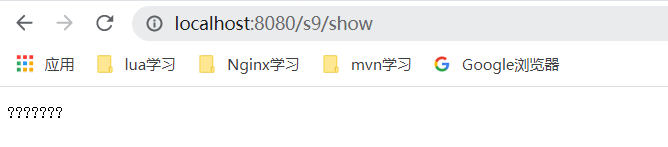

请求为http://localhost:8080/s9/servlet/show，没出现乱码，因为经过了过滤器

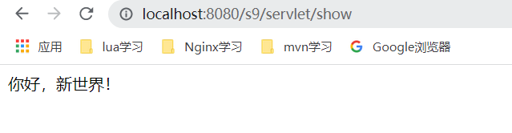

## 服务器启动时，Filter开始初始化

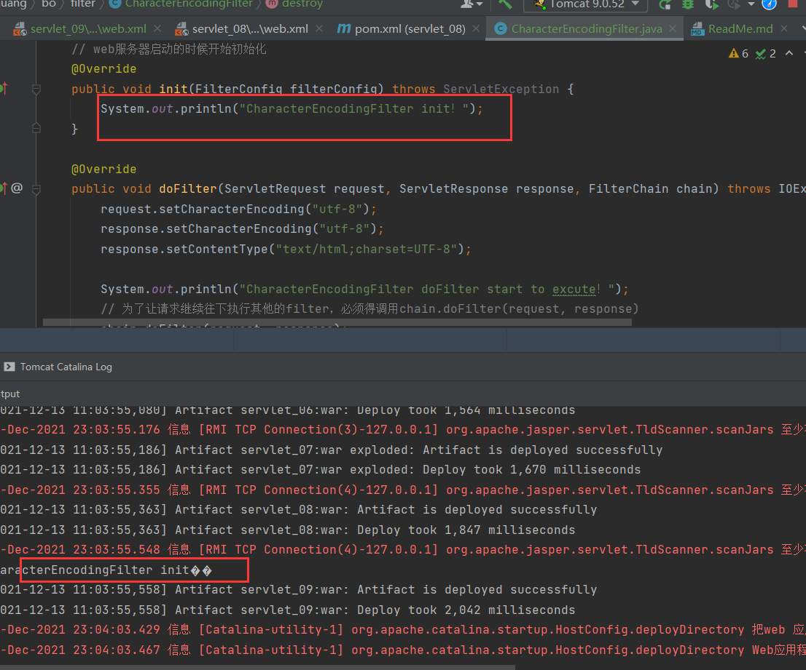

## 服务器停止时，Filter开始销毁

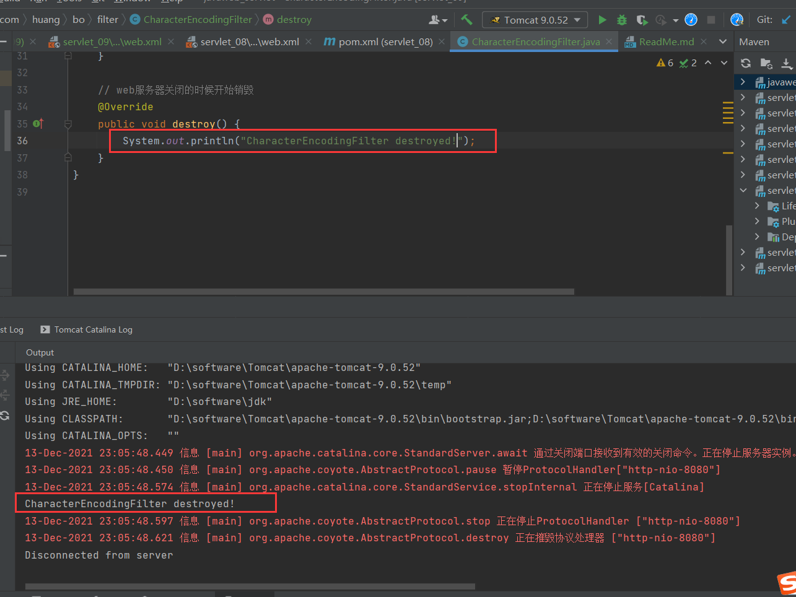

# Listener监听器

## 实例演示（统计在线人数）
代码如下：

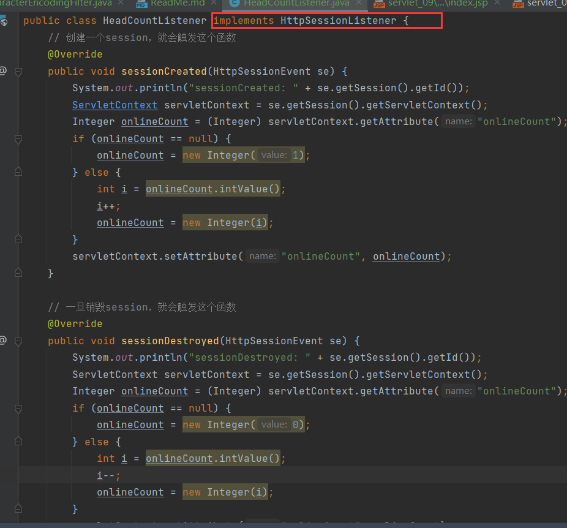

利用会话上下文统计在线人数，实现HttpSessionListener接口即可

web.xml配置如下：

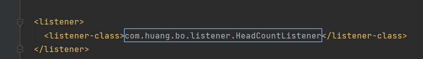

当启动服务时，显示效果如下：

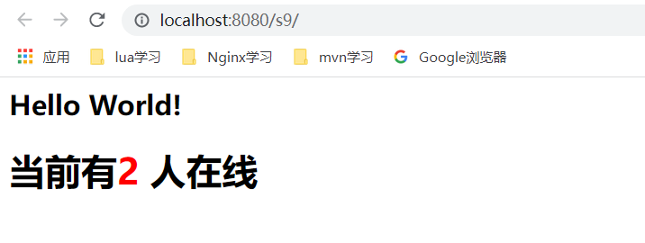

会显示有两个会话，原因时服务器启动时创建了多个会话（其中存在失败的会话被统计在内）

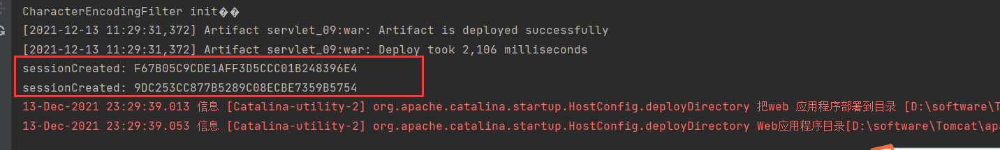

## 浏览器演示如下：

在新的浏览器启动时，显示效果如下：

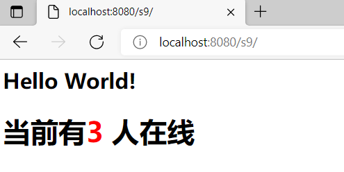

可见增加了一个会话！

