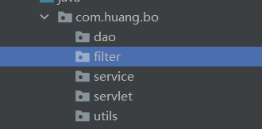
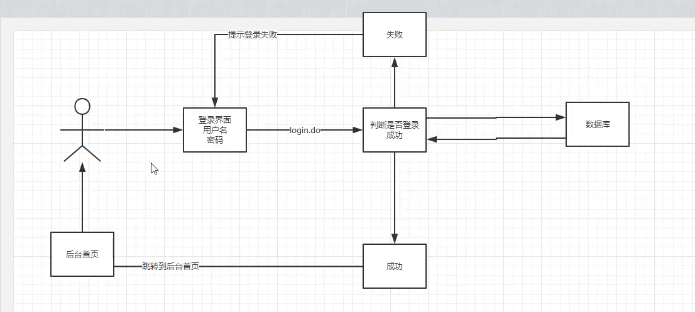

# 项目搭建准备工作
1、搭建一个maven web项目
2、配置Tomcat
3、测试项目是否能够跑起来
4、导入项目中会遇到的jar包
   jsp、servlet、mysql驱动、jstl、standard
5、创建项目包结构



6、编写实体类
ORM映射：表-类映射

7、编写基础公共类
* 数据库配置文件
  db.properties
* 编写数据库的公共类
  BaseDao.java
* 编写字符编码过滤器
  CharacterEncodingFilter

8、导入静态资源

# 登录实现
具体流程如下：



1、编写前端页面
2、设置首页
```xml
<welcome-file-list>
    <welcome-file>login.jsp</welcome-file>
  </welcome-file-list>
```
3、编写dao层得到用户登录的接口
```java
com.huang.bo.dao.user.UserDaoImpl.getLoginUser
```
4、编写dao接口的实现类

5、业务层接口

6、业务层实现类

7、编写servlet

8、注册servlet

# 登录功能优化
1、实现注销功能
思路：移除session，返回登录页面

# 登录拦截优化
只是像上面移除session，退出登录时从session移除用户信息后还可以登录，必须
设置拦截器
比如直接访问：http://localhost:8080/smbms/jsp/frame.jsp就可以登录（未设置拦截器之前）